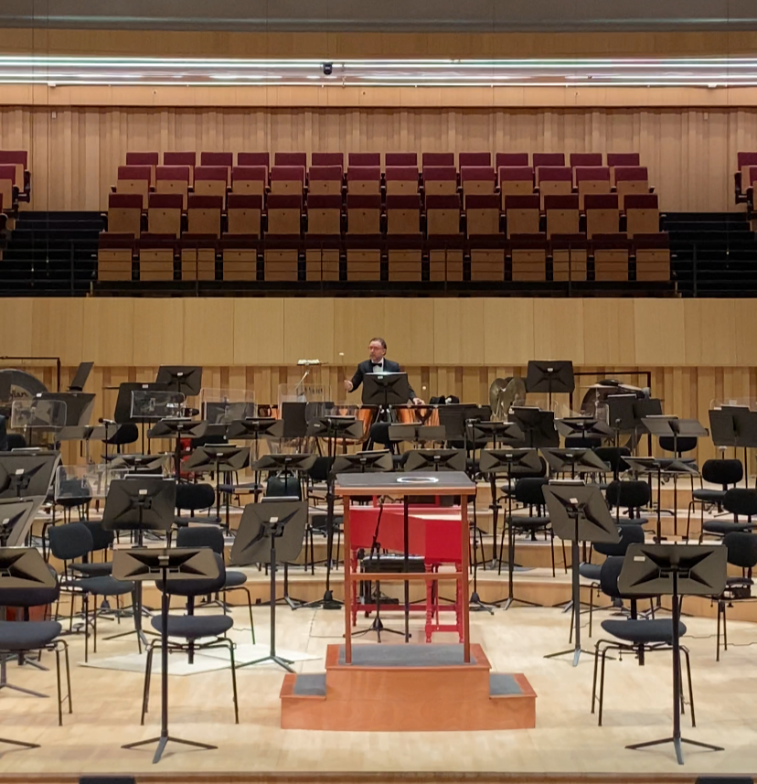
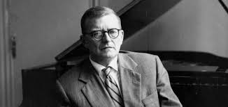

Ayer fue el concierto N°5 "Armonías Corales" del CEAC. Partió con una cantanta de Bach y después del intermedio, la sexta de Shostakovich.

Dejo a continuación una foto de Gerardo antes de partir el concierto:

La segunda parte estuvo intensa. La orquesta en resta ocasión estaba en una disposición distinta a la que usualmente usan. Las violas estaba direcamente al frente y se sentia un tremulo constante pero muy suave que ponía todo más tenso. 

También, estaba en la audiencia Tobias Volkmann. Me dio un poco de lata pedirle una foto, pero dejo acá una imagen de referencia.

Espero de corazón que quede él o Barbara Dragán dirigiendo el proximo año a la sinfónica. 

> "(...) In my latest symphony, music of a contemplative and lyrical order predominates. I wanted to convey in it the moods of spring, joy, youth."
> — Shostakovich a la prensa sobre su 6ta Sinfonía, 1939. 
