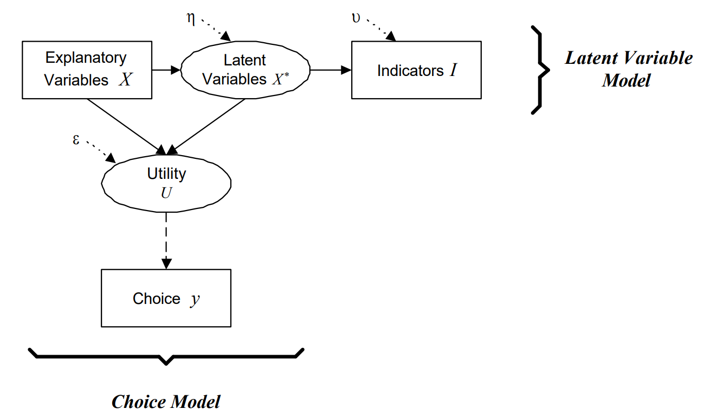

El [NLHPC](nlhpc.cl) es increible. Hay que valorar el hecho de que lo tengamos ahí a disposición como estudiantes de la FCFM (hay que simplemente solicitar una cuenta).

Durante el desarrollo de mi tesis, tengo que correr distintos modelos de elección discreta. En particular, debo ejecutar algunos [modelos de variables latentes](iclv.pdf) que tienen funciones de verosimilitud muy complejas (no convexas). La estimación de estos modelos toma mucho tiempo (del orden de varias horas a varios días), y yo no tengo ganas de dejar inutilizable mi computador por dos semanas mientras el modelo corre.




Es por lo anterior que traté de ingeniarmelas (junto a Claudio) para poder hacer una herramienta que me permitiera autimatizar la subida de modelos de Apollo en R directo desde mi IDE (PyCharm).


```python

#!/usr/bin/env python3
r"""
submit_to_nlhpc.py
==================
Genera el script SLURM, sube por SFTP y ejecuta jobs de R en NLHPC.

Estructura remota generada en $HOME:

    nlhpc-sender-runs/
    +-- dbs/                              <- bases compartidas
    |   \-- ...
    \-- <YYYYMMDD_HHMMSS>_<r_stem>/       <- una carpeta por corrida
        +-- script.R
        +-- script.sh
        +-- *.out / *.err
        \-- <db>.csv -> ../dbs/<db>.csv   <- symlinks a las bbdd

Magic comments aceptados al inicio del .R:

    # @slurm partition   = "main"        # cualquier directiva SLURM
    # @slurm cores       = 45
    # @slurm exclusive   = true
    # @db data/big.csv                    # sube si no existe
    # @db data/big.csv force              # siempre re-sube

Uso:
    python submit_to_nlhpc.py mi_script.R
    python submit_to_nlhpc.py mi_script.R --monitor
    python submit_to_nlhpc.py mi_script.R --config otro.toml --env otro.env
"""

import argparse
import os
import re
import sys
import time
from datetime import datetime
from pathlib import Path

# -- TOML: stdlib en Python 3.11+, fallback a tomli -------------------------
if sys.version_info >= (3, 11):
    import tomllib
else:
    try:
        import tomli as tomllib
    except ImportError:
        print("[ERROR] Python < 3.11 requiere 'tomli'. Ejecuta: pip install tomli")
        sys.exit(1)

try:
    import paramiko
except ImportError:
    print("[ERROR] Falta paramiko. Ejecuta: pip install paramiko")
    sys.exit(1)


# ---------------------------------------------
# 1. .env loader
# ---------------------------------------------

def load_dotenv(env_path: Path, override: bool = False) -> int:
    if not env_path.exists():
        return 0
    count = 0
    with open(env_path, "r", encoding="utf-8") as f:
        for raw in f:
            line = raw.strip()
            if not line or line.startswith("#") or "=" not in line:
                continue
            key, _, value = line.partition("=")
            key = key.strip()
            value = value.strip()
            if (value.startswith('"') and value.endswith('"')) or (
                    value.startswith("'") and value.endswith("'")
            ):
                value = value[1:-1]
            if override or key not in os.environ:
                os.environ[key] = value
                count += 1
    return count


# ---------------------------------------------
# 2. Interpolacion ${VAR}
# ---------------------------------------------

_ENV_VAR_RE = re.compile(r"\$\{(\w+)\}")


def expand_env_vars(obj):
    if isinstance(obj, str):
        def _repl(m: re.Match) -> str:
            var = m.group(1)
            val = os.environ.get(var)
            if val is None:
                raise ValueError(
                    f"Variable de entorno '${{{var}}}' usada en config "
                    f"pero no esta definida (revisa tu .env o el sistema)."
                )
            return val
        return _ENV_VAR_RE.sub(_repl, obj)
    if isinstance(obj, dict):
        return {k: expand_env_vars(v) for k, v in obj.items()}
    if isinstance(obj, list):
        return [expand_env_vars(v) for v in obj]
    return obj


# ---------------------------------------------
# 3. Cargar configuracion
# ---------------------------------------------

def load_config(config_path: str, env_path: str | None = None) -> dict:
    config_path = Path(config_path)
    env_path = Path(env_path) if env_path else config_path.parent / ".env"

    n = load_dotenv(env_path)
    if n:
        print(f"[i] Cargadas {n} variables desde {env_path}")

    with open(config_path, "rb") as f:
        cfg = tomllib.load(f)
    return expand_env_vars(cfg)


# ---------------------------------------------
# 4. Magic comments (@slurm + @db)
# ---------------------------------------------

_SLURM_MAGIC_RE = re.compile(r"^\s*#\s*@slurm\s+(\w+)\s*=\s*(.+?)\s*$")
_DB_MAGIC_RE    = re.compile(r"^\s*#\s*@db\s+(.+?)\s*$")


def _strip_quotes(s: str) -> str:
    if (s.startswith('"') and s.endswith('"')) or (
            s.startswith("'") and s.endswith("'")
    ):
        return s[1:-1]
    return s


def parse_magic_comments(r_file: Path, max_lines: int = 80) -> tuple[dict, list[dict]]:
    """
    Devuelve (slurm_overrides, dbs).
    `dbs` es una lista de {'path': str_local, 'force': bool}.
    """
    slurm_overrides: dict = {}
    dbs: list[dict] = []
    try:
        with open(r_file, "r", encoding="utf-8") as f:
            for i, line in enumerate(f):
                if i >= max_lines:
                    break
                stripped = line.strip()
                if stripped and not stripped.startswith("#"):
                    break

                # @slurm key = value
                m = _SLURM_MAGIC_RE.match(line)
                if m:
                    key, raw = m.group(1), _strip_quotes(m.group(2).strip())
                    low = raw.lower()
                    if low in ("true", "false"):
                        val: object = (low == "true")
                    else:
                        try:
                            val = int(raw)
                        except ValueError:
                            val = raw
                    slurm_overrides[key] = val
                    continue

                # @db <path> [force]
                m = _DB_MAGIC_RE.match(line)
                if m:
                    raw = _strip_quotes(m.group(1).strip())
                    parts = raw.rsplit(None, 1)
                    force = False
                    if len(parts) == 2 and parts[1].lower() == "force":
                        path_str, force = parts[0], True
                    else:
                        path_str = raw
                    dbs.append({"path": _strip_quotes(path_str), "force": force})
    except Exception as e:
        print(f"[!] No se pudo leer magic comments: {e}")
    return slurm_overrides, dbs


# ---------------------------------------------
# 5. Generar el script SLURM
# ---------------------------------------------

def generate_slurm_script(r_filename: str, slurm_cfg: dict,
                          db_dir_abs: str, run_dir_abs: str) -> str:
    s = slurm_cfg
    stem = Path(r_filename).stem
    job_name = f"{s.get('job_name_prefix', 'R')}_{stem}"
    exclusive = bool(s.get("exclusive", False))

    header = [
        "#!/bin/bash",
        "#--------------- Script SBATCH - NLHPC ----------------",
        f"#SBATCH -J {job_name}",
        f"#SBATCH -p {s['partition']}",
        f"#SBATCH --ntasks=1",
        f"#SBATCH --cpus-per-task={s['cores']}",
        f"#SBATCH --mem-per-cpu={s['mem_per_cpu']}",
        f"#SBATCH --hint=nomultithread",
        f"#SBATCH --mail-user={s['mail']}",
        f"#SBATCH --mail-type={s['mail_type']}",
        f"#SBATCH -t {s['time']}",
        f"#SBATCH -o {job_name}_%j.out",
        f"#SBATCH -e {job_name}_%j.err",
    ]
    if exclusive:
        header.append("#SBATCH --exclusive")

    body = [
        "",
        "#----------------- Toolchain -------------------------",
        "module purge",
        f"module load {s['r_module']}",
        "",
        "#----------------- Threading -------------------------",
        "# BLAS a 1 hilo: Apollo (mclapply/fork) maneja la paralelizacion en R.",
        "# Si tu workload NO usa fork (e.g. brms/Stan, lm gigante), invierte:",
        "# pon BLAS=$SLURM_CPUS_PER_TASK y no uses parallel:: en R.",
        "export OMP_NUM_THREADS=1",
        "export OPENBLAS_NUM_THREADS=1",
        "export MKL_NUM_THREADS=1",
        "export VECLIB_MAXIMUM_THREADS=1",
        "export NUMEXPR_NUM_THREADS=1",
        "export OMP_PLACES=cores",
        "export OMP_PROC_BIND=close",
        "",
        "#----------------- Variables para R ------------------",
        f'export NLHPC_DB_DIR="{db_dir_abs}"',
        f'export NLHPC_RUN_DIR="{run_dir_abs}"',
        "",
        "#----------------- Logging ---------------------------",
        'echo "============================================"',
        'echo "Job ID         : $SLURM_JOB_ID"',
        'echo "Job Name       : $SLURM_JOB_NAME"',
        'echo "Node           : $SLURMD_NODENAME"',
        'echo "Partition      : $SLURM_JOB_PARTITION"',
        'echo "CPUs por tarea : $SLURM_CPUS_PER_TASK"',
        'echo "Mem por CPU    : ${SLURM_MEM_PER_CPU} MB"',
        'echo "Mem total      : $((SLURM_MEM_PER_CPU * SLURM_CPUS_PER_TASK)) MB"',
        'echo "Run dir        : $NLHPC_RUN_DIR"',
        'echo "DB dir         : $NLHPC_DB_DIR"',
        'echo "Inicio         : $(date)"',
        'echo "============================================"',
        "",
        "#----------------- Ejecucion -------------------------",
        f"time Rscript {r_filename}",
        "RC=$?",
        "",
        "#----------------- Cierre + seff ---------------------",
        'echo "============================================"',
        'echo "Fin            : $(date)"',
        'echo "Exit code      : $RC"',
        'echo "--- seff (eficiencia CPU/RAM) ---"',
        'seff $SLURM_JOB_ID 2>/dev/null || echo "(seff no disponible aun)"',
        'echo "============================================"',
        "",
        "exit $RC",
        "",
    ]
    return "\n".join(header + body)


# ---------------------------------------------
# 6. Helpers SFTP
# ---------------------------------------------

def sftp_exists(sftp: paramiko.SFTPClient, path: str) -> bool:
    try:
        sftp.stat(path)
        return True
    except FileNotFoundError:
        return False
    except IOError:
        return False


def sftp_mkdir_p(sftp: paramiko.SFTPClient, path: str) -> None:
    parts = path.rstrip("/").split("/")
    current = ""
    for part in parts:
        if not part:
            current = "/"
            continue
        current = f"{current}/{part}" if current != "/" else f"/{part}"
        try:
            sftp.mkdir(current)
        except IOError:
            pass


def sftp_symlink_force(sftp: paramiko.SFTPClient, target: str, link_path: str) -> None:
    try:
        sftp.remove(link_path)
    except FileNotFoundError:
        pass
    except IOError:
        pass
    sftp.symlink(target, link_path)


def _make_progress_cb(label: str):
    state = {"last_pct": -5.0}
    def cb(transferred: int, total: int):
        if total <= 0:
            return
        pct = transferred / total * 100
        if pct - state["last_pct"] >= 5 or transferred == total:
            state["last_pct"] = pct
            mb = transferred / 1_048_576
            tot_mb = total / 1_048_576
            sys.stdout.write(
                f"\r    {label}: {pct:5.1f}%  ({mb:.1f}/{tot_mb:.1f} MB)"
            )
            sys.stdout.flush()
            if transferred == total:
                sys.stdout.write("\n")
    return cb


# ---------------------------------------------
# 7. SSH
# ---------------------------------------------

def connect_ssh(config: dict) -> paramiko.SSHClient:
    cfg = config["ssh"]
    ssh = paramiko.SSHClient()
    ssh.set_missing_host_key_policy(paramiko.AutoAddPolicy())

    kwargs = {
        "hostname": cfg["host"],
        "port":     cfg.get("port", 22),
        "username": cfg["username"],
    }
    if cfg.get("key_path"):
        kwargs["key_filename"] = os.path.expanduser(cfg["key_path"])
    elif cfg.get("password"):
        kwargs["password"] = cfg["password"]
    else:
        raise ValueError("Define 'key_path' o 'password' en [ssh].")

    ssh.connect(**kwargs)
    return ssh


# ---------------------------------------------
# 8. Monitoreo
# ---------------------------------------------

def monitor_job(ssh: paramiko.SSHClient, job_id: str, interval: int = 30) -> None:
    print(f"\n[>] Monitoreando job {job_id} (Ctrl+C sale sin cancelarlo)...")
    try:
        while True:
            _, stdout, _ = ssh.exec_command(f"squeue -j {job_id} -h -o '%T %r'")
            state = stdout.read().decode().strip()
            if not state:
                print(f"\n[OK] Job {job_id} finalizado.")
                _, so, _ = ssh.exec_command(f"seff {job_id}")
                print(so.read().decode())
                break
            print(f"  [{time.strftime('%H:%M:%S')}] Estado: {state}", end="\r")
            time.sleep(interval)
    except KeyboardInterrupt:
        print(f"\n[!] Monitoreo interrumpido. Job {job_id} sigue corriendo.")


# ---------------------------------------------
# 9. Pipeline principal
# ---------------------------------------------

def submit_job(r_file_path: str, config_path: str | None = None,
               env_path: str | None = None, monitor: bool = False) -> str | None:
    if config_path is None:
        config_path = Path(__file__).parent / "nlhpc_config.toml"
    config = load_config(str(config_path), env_path)

    r_file = Path(r_file_path).resolve()
    if not r_file.exists():
        print(f"[ERROR] El archivo R no existe: {r_file}")
        sys.exit(1)
    if r_file.suffix.lower() != ".r":
        print(f"[ERROR] El archivo no parece un script R "
              f"(extension '{r_file.suffix}', se esperaba '.R').")
        print(f"        Archivo recibido: {r_file}")
        sys.exit(1)
    r_name = r_file.name

    # -- Magic comments ---------------------------------------------------
    slurm_cfg = dict(config["slurm"])
    magic_slurm, dbs = parse_magic_comments(r_file)
    if magic_slurm:
        print(f"[i] Magic comments SLURM en {r_name}: {magic_slurm}")
    if dbs:
        print(f"[i] DBs declaradas: " + ", ".join(
            f"{d['path']}{' (force)' if d['force'] else ''}" for d in dbs
        ))
    slurm_cfg.update(magic_slurm)

    # -- Resolver DBs locales ---------------------------------------------
    db_files: list[dict] = []
    for d in dbs:
        local = Path(d["path"]).expanduser()
        if not local.is_absolute():
            local = r_file.parent / local
        local = local.resolve()
        if not local.exists():
            print(f"[ERROR] DB declarada pero no existe localmente: {local}")
            sys.exit(1)
        db_files.append({"local": local, "force": d["force"]})

    # -- Conectar ---------------------------------------------------------
    host = config["ssh"]["host"]
    print(f"[>] Conectando a {host} como {config['ssh']['username']}...")
    ssh = connect_ssh(config)
    sftp = ssh.open_sftp()
    print(f"[OK] Conexion SSH establecida")

    # -- Resolver rutas remotas absolutas ---------------------------------
    runs_dir_cfg = config.get("remote", {}).get("runs_dir", "nlhpc-sender-runs")
    if runs_dir_cfg.startswith("/"):
        runs_root = runs_dir_cfg
    else:
        home = sftp.normalize(".")
        runs_root = f"{home}/{runs_dir_cfg}"

    dbs_dir_abs = f"{runs_root}/dbs"
    run_id = f"{datetime.now().strftime('%Y%m%d_%H%M%S')}_{r_file.stem}"
    run_dir_abs = f"{runs_root}/{run_id}"

    sftp_mkdir_p(sftp, runs_root)
    sftp_mkdir_p(sftp, dbs_dir_abs)
    sftp_mkdir_p(sftp, run_dir_abs)
    print(f"[OK] Run dir remoto         -> {run_dir_abs}")

    # -- Subir DBs (skip si existen) --------------------------------------
    for db in db_files:
        local = db["local"]
        remote_path = f"{dbs_dir_abs}/{local.name}"
        if not db["force"] and sftp_exists(sftp, remote_path):
            print(f"[=] DB ya existe, se reutiliza  -> {remote_path}")
        else:
            verb = "Re-subiendo (force)" if db["force"] and sftp_exists(sftp, remote_path) else "Subiendo"
            print(f"[>] {verb} DB              -> {remote_path}")
            sftp.put(str(local), remote_path,
                     callback=_make_progress_cb(local.name))
        # Symlink en la carpeta de la corrida
        link_path = f"{run_dir_abs}/{local.name}"
        sftp_symlink_force(sftp, f"../dbs/{local.name}", link_path)

    # -- Generar y subir .sh ----------------------------------------------
    sh_local = r_file.parent / (r_file.stem + ".sh")
    sh_content = generate_slurm_script(r_name, slurm_cfg,
                                       dbs_dir_abs, run_dir_abs)
    # OJO: escribimos en binario para evitar la conversion de \n -> \r\n que
    # hace Python en Windows con write_text. SLURM rechaza scripts con CRLF.
    sh_local.write_bytes(sh_content.encode("utf-8"))
    print(f"[OK] Script SLURM generado  -> {sh_local}")
    print(f"     |- partition={slurm_cfg['partition']}  "
          f"cores={slurm_cfg['cores']}  time={slurm_cfg['time']}")

    sftp.put(str(r_file), f"{run_dir_abs}/{r_name}")
    print(f"[OK] Subido R script        -> {run_dir_abs}/{r_name}")
    sftp.put(str(sh_local), f"{run_dir_abs}/{sh_local.name}")
    print(f"[OK] Subido SLURM script    -> {run_dir_abs}/{sh_local.name}")
    sftp.close()

    # -- sbatch desde la carpeta de la corrida ----------------------------
    cmd = f"cd {run_dir_abs} && sbatch {sh_local.name}"
    _, stdout, stderr = ssh.exec_command(cmd)
    out = stdout.read().decode().strip()
    err = stderr.read().decode().strip()
    if err:
        print(f"[!] STDERR: {err}")
    if out:
        print(f"[OK] {out}")

    job_id = out.split()[-1] if "Submitted batch job" in out else None
    if job_id:
        prefix = slurm_cfg.get("job_name_prefix", "R")
        sep = "=" * 54
        print(f"\n{sep}")
        print(f"  Run ID    : {run_id}")
        print(f"  Job ID    : {job_id}")
        print(f"  Output    : {run_dir_abs}/{prefix}_{r_file.stem}_{job_id}.out")
        print(f"{sep}\n")

    if monitor and job_id:
        monitor_job(ssh, job_id)

    ssh.close()
    return job_id


# ---------------------------------------------
# 10. CLI
# ---------------------------------------------

if __name__ == "__main__":
    parser = argparse.ArgumentParser(
        description="Sube y ejecuta un script R en NLHPC via SLURM/SSH"
    )
    parser.add_argument("r_file", help="Ruta al archivo .R")
    parser.add_argument("--config", default=None, help="Ruta al .toml")
    parser.add_argument("--env", default=None, help="Ruta al .env")
    parser.add_argument("--monitor", action="store_true",
                        help="Esperar hasta que el job termine")
    args = parser.parse_args()
    submit_job(args.r_file, args.config, args.env, args.monitor)
```