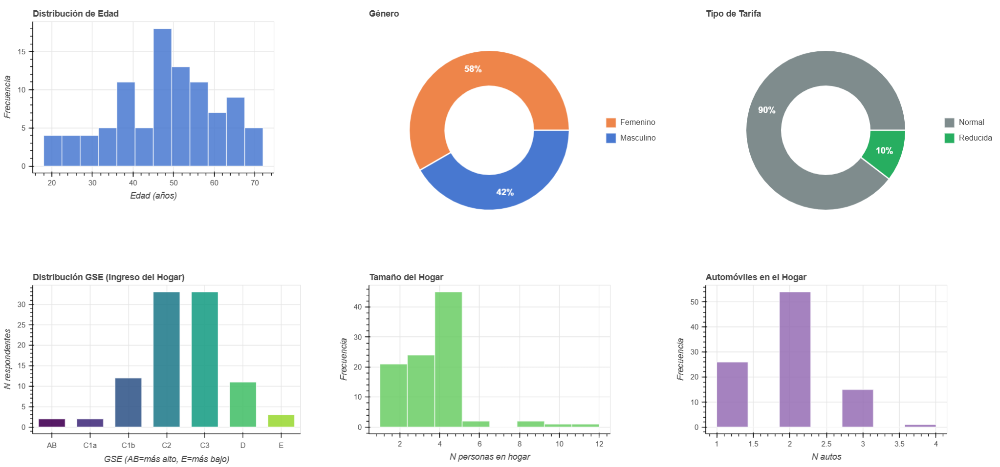
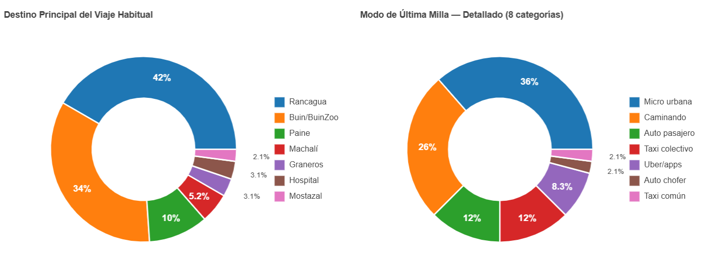
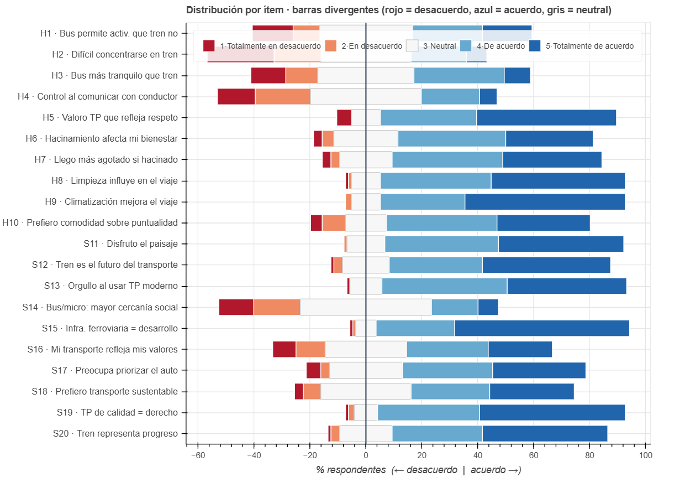
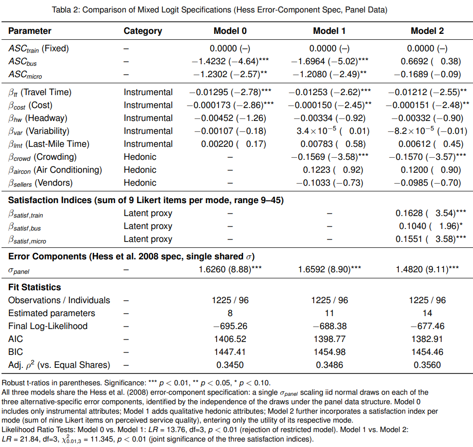

## Caracterización de la muestra

El primer piloto contó con 224 respuestas desde [Netquest](https://www.netquest.com/encuestas-online-investigacion), de las cuales 96 respuestas fueron consideradas válidas (gente que efectivamente usaba el corredor).

Es un poco complejo el índice de incidencia (estamos bajo el 50% de opbacioón objetivo vs población encuestada). Ojalá se pueda hacer algo al respecto desde Netquest.

A continuación, se muestran algunos gráficos de caracterización:

 

 

 


## Modelos preliminares

Se plantearon 3 modelos de Logit Mixto. Las especificaciones se muestran a continuación

### MXL - Efecto panel + variables instrumentales (medibles)


### MXL - Efecto panel + variables instrumentales + variables hedónicas

### MXL - Indicadores de satisfacción por modo agregados


## Resultados

A continuación, se muestran los resultados de las estimaciones de los modelos anteriores:


 


## Código

### MXL - Efecto panel

```R
# ==============================================================================
# LOGIT MIXTO PANEL - ESPECIFICACION HESS et al. (2008)
# ==============================================================================
# Componentes de error iid (entre alternativas, no entre observaciones)
# en las TRES alternativas, con UNA sola sigma compartida.
# Identificacion garantizada por la independencia de los draws entre
# alternativas y la estructura panel.
# Referencia: Apollo Manual, seccion 6.2 / Figura 6.7.
# ==============================================================================

# -- Configuracion SLURM (procesado por submit_to_nlhpc.py) -------------------
# @slurm partition   = "debug"
# @slurm time        = "00:30:00"
# @slurm cores       = 44
# @slurm mem_per_cpu = 345
# @db C:/Users/Pablo/Desktop/tesis-magister/SP/netquest-soft_start-v2/data/master_db_netquest_soft_start_v2.csv


# 1. ENTORNO -------------------------------------------------------------------
if (!nzchar(Sys.getenv("SLURM_JOB_ID")) &&
  requireNamespace("rstudioapi", quietly = TRUE) &&
  rstudioapi::isAvailable()) {
  setwd(dirname(rstudioapi::getSourceEditorContext()$path))
}

# install.packages("apollo")

library(apollo)
library(dplyr)

rm(list = ls())
apollo_initialise()

# Cores: NLHPC lo dicta via SLURM; local default = 8
nCores_use <- as.integer(Sys.getenv("SLURM_CPUS_PER_TASK", unset = "8"))
cat("[INFO] Usando", nCores_use, "cores\n")

# Path BBDD
db_dir <- Sys.getenv(
  "NLHPC_DB_DIR",
  unset = "C:/Users/Pablo/Desktop/tesis-magister/SP/netquest-soft_start-v2/data/"
)
database <- read.csv(file.path(db_dir, "master_db_netquest_soft_start_v2.csv"))
names(database) <- trimws(names(database))
database[is.na(database)] <- 0

# FILTRO: Eliminar observaciones donde se eligio el opt-out (alternativa 4)
database <- subset(database, choice != 4)

# ==============================================================================
# 2. CONFIGURACION DE APOLLO
# ==============================================================================
apollo_control <- list(
  modelName       = "modelo3-Panel_Hess_SinOptOut - Netquest v2",
  modelDescr      = "Logit Mixto Panel - Hess et al. 2008 (EC iid en las 3 alternativas) - Sin Opt-Out - Netquest v2",
  indivID         = "id_response",
  mixing          = TRUE,
  nCores          = 8,
  outputDirectory = "output"
)

# ==============================================================================
# 3. DEFINICION DE PARAMETROS A ESTIMAR
# ==============================================================================
apollo_beta <- c(
  asc_train = 0,
  asc_bus   = 0,
  asc_micro = 0,

  # Nivel de Servicio
  b_tt      = 0,
  b_cost    = 0,
  b_lmt     = 0,
  b_hw      = 0,

  # Confort y Confiabilidad
  b_var     = 0,
  b_crowd   = 0,
  b_aircon  = 0,
  b_sellers = 0,

  # ----------------------------------------------------------------------------
  # CAMBIO CLAVE 1: una sola sigma compartida en lugar de sigma_bus y sigma_micro
  # Valor inicial 0.5 (no 0) para evitar partida en una region plana de la LL.
  # ----------------------------------------------------------------------------
  sigma_panel = 0.5
)

# Constante del tren como referencia (esto no cambia respecto al modelo anterior)
apollo_fixed <- "asc_train"

# ==============================================================================
# 4. CONFIGURACION DE DRAWS
# ------------------------------------------------------------------------------
# CAMBIO CLAVE 2: TRES draws normales independientes, uno por alternativa
# (antes habian dos: draw_bus y draw_micro). Ahora se incluye tambien draw_train.
# La independencia entre estos tres draws es lo que garantiza identificacion
# en datos panel pese a tener EC en TODAS las alternativas.
# ==============================================================================
apollo_draws = list(
  interDrawsType = "mlhs",
  interNDraws    = 2000,
  interUnifDraws = c(),
  interNormDraws = c("draw_train", "draw_bus", "draw_micro"),
  intraDrawsType = "halton",
  intraNDraws    = 0,
  intraUnifDraws = c(),
  intraNormDraws = c()
)

# ==============================================================================
# 5. COEFICIENTES ALEATORIOS
# ------------------------------------------------------------------------------
# Tres EC, todos con la MISMA sigma_panel (homocedasticidad). Cada EC usa
# un draw distinto, lo que los hace independientes entre alternativas pero
# constantes a lo largo de las T situaciones de cada persona (efecto panel).
# ==============================================================================
apollo_randCoeff = function(apollo_beta, apollo_inputs){
  randcoeff = list()
  randcoeff[["ec_train"]] = sigma_panel * draw_train
  randcoeff[["ec_bus"]]   = sigma_panel * draw_bus
  randcoeff[["ec_micro"]] = sigma_panel * draw_micro
  return(randcoeff)
}

apollo_inputs <- apollo_validateInputs()

# ==============================================================================
# 6. FUNCION DE PROBABILIDADES
# ------------------------------------------------------------------------------
# CAMBIO CLAVE 3: el EC se suma a las TRES utilidades (incluida la del tren),
# no solo a las J-1 alternativas como en el modelo anterior.
# ==============================================================================
apollo_probabilities <- function(apollo_beta, apollo_inputs, functionality = "estimate"){

  apollo_attach(apollo_beta, apollo_inputs)
  on.exit(apollo_detach(apollo_beta, apollo_inputs))

  P <- list()
  V <- list()

  V[["train"]] <- asc_train + ec_train +
    b_tt      * train_tt +
    b_cost    * train_cost +
    b_lmt     * train_lmt +
    b_hw      * train_headway +
    b_var     * train_arrival_time_variability +
    b_crowd   * train_crowding_ordinal +
    b_aircon  * train_aircon_ordinal +
    b_sellers * train_sellers_ordinal

  V[["bus"]]   <- asc_bus + ec_bus +
    b_tt      * bus_tt +
    b_cost    * bus_cost +
    b_lmt     * bus_lmt +
    b_hw      * bus_headway +
    b_var     * bus_arrival_time_variability +
    b_crowd   * bus_crowding_ordinal +
    b_aircon  * bus_aircon_ordinal +
    b_sellers * bus_sellers_ordinal

  V[["micro"]] <- asc_micro + ec_micro +
    b_tt      * micro_tt +
    b_cost    * micro_cost +
    b_lmt     * micro_lmt +
    b_hw      * micro_headway +
    b_var     * micro_arrival_time_variability +
    b_crowd   * micro_crowding_ordinal +
    b_aircon  * micro_aircon_ordinal +
    b_sellers * micro_sellers_ordinal

  mnl_settings <- list(
    alternatives = c(train = 1, bus = 2, micro = 3),
    avail        = list(train = av_train, bus = av_bus, micro = av_micro),
    choiceVar    = choice,
    utilities    = V
  )

  P[["model"]] <- apollo_mnl(mnl_settings, functionality)
  P <- apollo_panelProd(P, apollo_inputs, functionality)
  P <- apollo_avgInterDraws(P, apollo_inputs, functionality)
  P <- apollo_prepareProb(P, apollo_inputs, functionality)

  return(P)
}

# ==============================================================================
# 7. ESTIMACION Y RESULTADOS
# ==============================================================================
model <- apollo_estimate(apollo_beta, apollo_fixed, apollo_probabilities, apollo_inputs)

apollo_modelOutput(model)
apollo_saveOutput(model)
```
